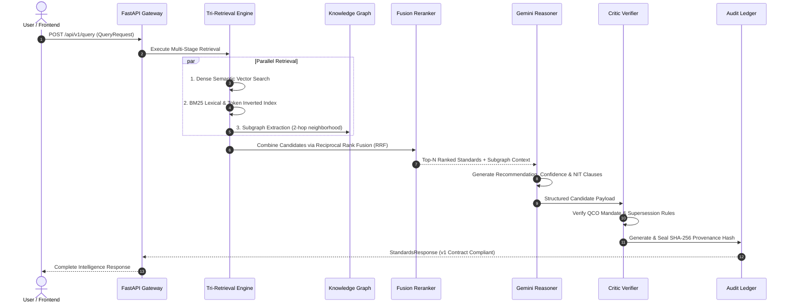
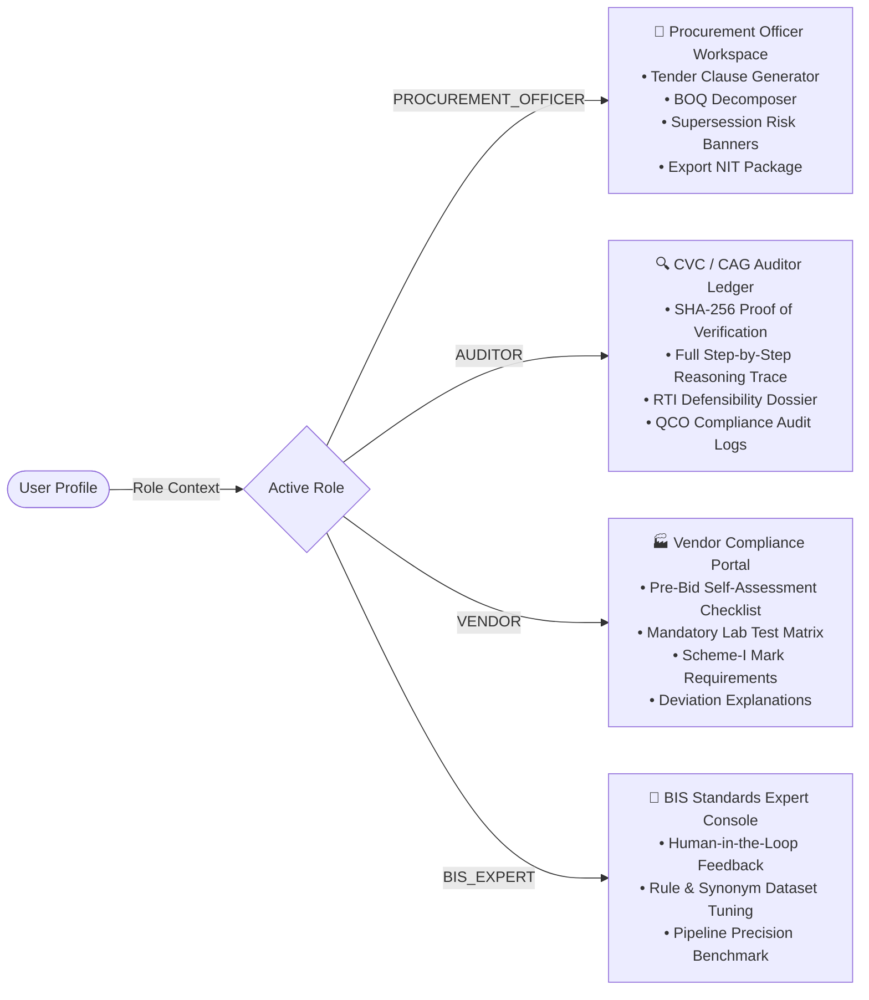

# System Architecture & Technical Design Document
## SIH 2026 — BIS Standards Intelligence Platform (ManakAI)

---

## 1. Executive Summary & Problem Statement

### 1.1 Context & Problem
Public procurement in India involves thousands of crore rupees annually across central ministries, state departments, defense organizations, and public sector undertakings (PSUs). Drafting procurement tenders (NIT - Notice Inviting Tenders) requires specifying precise technical standards established by the Bureau of Indian Standards (BIS).

However, public procurement faces major critical systemic challenges:
1. **Stale & Superseded Standards**: Tenders frequently cite obsolete Indian Standards (IS), causing vendor confusion, contract disputes, and supply rejections.
2. **Missing Statutory QCO Compliance**: Quality Control Orders (QCOs) issued by line ministries make specific BIS certifications legally mandatory. Omitting QCO clauses violates statutory norms.
3. **Single-Vendor Lock-in & Bias**: Vague or overly restrictive specifications lead to restrictive bidding, violating General Financial Rules (GFR) and Central Vigilance Commission (CVC) guidelines.
4. **Auditing & RTI Friction**: CAG auditors and vigilance officers spend weeks auditing paper/PDF tender trails to verify why certain standards were mandated.

### 1.2 Solution: ManakAI
**ManakAI** is a production-grade **Knowledge-Graph Augmented Retrieval (GraphRAG) Intelligence Platform** that automates BIS standard discovery, multi-item tender decomposition, normative supersession verification, NIT specification generation, and cryptographic audit sealing.

---

## 2. High-Level System Architecture

```mermaid
flowchart TB
    subgraph ClientLayer["🖥️ Frontend & Client Applications (React 19 + TypeScript + Vite)"]
        PO["👔 Procurement Officer Workspace\n(NIT Generator, Decomposition)"]
        AUD["🔍 CVC / CAG Auditor Portal\n(SHA-256 Ledger, RTI Dossier)"]
        VEN["🏭 Vendor Compliance Gateway\n(Self-Checklists, Testing)"]
        EXP["🔬 BIS Expert Feedback Loop\n(Active Learning, Human-in-Loop)"]
        KG3D["🕸️ 3D Force-Directed Graph View\n(Normative Citation Subgraphs)"]
    end

    subgraph GatewayLayer["⚡ API Gateway & Server Interfaces"]
        FastAPI["🚀 FastAPI REST Engine (:8000)\n• /api/v1/query\n• /api/v1/tender-upload\n• /api/v1/export-nit\n• /api/v1/feedback\n• /api/v1/alerts"]
        WS["📡 Real-Time WebSocket Channel (:8000)\n• ws://.../api/v1/ws/query-stream"]
        MCP["🤖 Model Context Protocol Server (:8001)\n• query_bis_standards\n• verify_tender_compliance\n• get_subgraph_nodes"]
    end

    subgraph IntelligenceTier["🧠 Core Intelligence & GraphRAG Pipeline"]
        BU["🌐 Bhashini Multilingual Translator\n(Indic ↔ English Query Normalization)"]
        TRI["🎯 Tri-Retrieval Fusion Engine\n• Dense Vector (Gemini Embeddings)\n• Lexical BM25 + Full-Text Search\n• Normative Knowledge Graph Traversal"]
        RRF["⚖️ Reciprocal Rank Fusion (RRF) & Reranker"]
        LLM["🤖 Dual LLM Gateway (Gemini 2.5 Flash / Pro)\n(Multi-Key Rotation Pool & Fallback Engine)"]
        CRITIC["🛡️ Critic & Guardrail Verifier\n(Hallucination & Normative Checks)"]
        AUDIT["🔒 Cryptographic SHA-256 Audit Sealer"]
    end

    subgraph DataStorageLayer["🗄️ Knowledge Base & Data Repositories"]
        CATALOG[("📚 BIS Master Standards Catalog\n(Active, Withdrawn, Amendments)")]
        QCO_MAT[("📜 Statutory QCO Enforcement Matrix\n(Mandatory Certification Schemes)")]
        GRAPH_DB[("🕸️ NetworkX Normative Citation Graph\n(Parent-Child, Superseded, Allied Tests)")]
        LEDGER[("🧾 Immutable Audit Records & Feedback Store")]
    end

    ClientLayer --> GatewayLayer
    GatewayLayer --> IntelligenceTier
    IntelligenceTier --> DataStorageLayer
```



---

## 3. Core Subsystems & Technical Workflows

### 3.1 Data Ingestion & Knowledge Graph Pipeline
The data ingestion subsystem builds and maintains the foundational knowledge representations of Indian Standards:

1. **BIS Standards Catalog Ingestion**:
   - Parses official BIS registries into structured records containing: `is_number`, `title`, `status` (`ACTIVE`, `WITHDRAWN`, `UNDER_REVISION`), `year_published`, `scope`, `clause_breakdown`, `mandatory_test_methods`.
2. **Normative Reference Graph Construction**:
   - Extracts all cross-standard references (e.g., *"Cement testing shall conform to IS 4031 (Part 1 to Part 6)"*).
   - Creates a directed multi-edge graph with relationship types:
     - `NORMATIVELY_REFERENCES`: Standard A depends on Standard B for testing/material specs.
     - `SUPERSEDES` / `SUPERSEDED_BY`: Standard A replaces old Standard B.
     - `ALLIED_TEST_STANDARD`: Standard B specifies the laboratory testing protocols for Standard A.
     - `QCO_MANDATED_UNDER`: Standard A is legally enforced under a specific ministry QCO.
3. **QCO Statutory Enforcement Engine**:
   - Maps Central Government Quality Control Orders (QCOs) by Gazette notification number, enforcement date, line ministry (e.g., DPIIT, Ministry of Steel), and certification scheme (e.g., Scheme-I Standard Mark).

---

### 3.2 The Tri-Retrieval & GraphRAG Engine



#### Detailed Retrieval Phases:
1. **Query Parsing & Multilingual Normalization**:
   - Ingests queries in English, Hindi, Tamil, Telugu, Marathi, Gujarati, or Bengali.
   - Extracts domain entities: material class, grade, usage environment, tender constraints.
2. **Tri-Retrieval Search**:
   - **Dense Semantic Retrieval**: High-dimensional embeddings capture conceptual intent (e.g., *"waterproof roof sealant"* matches *IS 2645*).
   - **Lexical BM25 Retrieval**: Matches exact standard numbers (e.g., *IS 456*), grades (*Fe 500D*), and technical jargon.
   - **Graph Traversal**: Expands initial candidates by extracting allied testing standards and checking if any candidate is superseded.
3. **Reciprocal Rank Fusion (RRF) & Reranking**:
   $$RRF(d) = \sum_{m \in M} \frac{1}{k + r_m(d)}$$
   Combines multi-modal candidate rankings with a smoothing constant ($k = 60$).
4. **Dual-Stage LLM Reasoning**:
   - Uses **Gemini Flash** for high-throughput entity extraction and candidate scoring.
   - Uses **Gemini Pro** for deep multi-hop reasoning, confidence derivation, and legal clause synthesis.
5. **Critic Guardrail & Audit Sealing**:
   - Validates that active standards are not marked superseded.
   - Computes an immutable SHA-256 cryptographic seal across input parameters, timestamp, model ID, and output recommendations.

---

### 3.3 Multi-Item Tender Document Decomposition

When users upload complete tender documents (PDF/DOCX/Scanned images):
1. **Layout & Table Extraction**:
   - Utilizes `PyMuPDF` and `pdfplumber` to extract document hierarchies, clauses, and Bill of Quantities (BOQ) tables.
2. **Line-Item Decomposition**:
   - Identifies individual materials/work items (e.g., *Item 1: Structural Steel*, *Item 2: Ready Mix Concrete*, *Item 3: UPVC Conduits*).
3. **Per-Item Standards Analysis**:
   - Concurrently maps each line item through the Tri-Retrieval pipeline.
4. **Conflict & Staleness Matrix**:
   - Highlights items referencing obsolete standards or missing mandatory QCO clauses across the entire tender schedule.

---

## 4. Role-Based Workspaces & Personas

ManakAI adapts its user experience, intelligence depth, and redaction rules dynamically based on the active role:



### Role Matrix Comparison

| Feature Capability | Procurement Officer | Auditor (CVC / CAG) | Vendor / Bidder | BIS Expert |
| :--- | :---: | :---: | :---: | :---: |
| **Search & Query Intelligence** | ✅ | ✅ | ✅ | ✅ |
| **NIT Spec Clause Generator** | ✅ | ❌ | ❌ | ❌ |
| **Decompose Multi-Item Tender PDFs** | ✅ | ✅ | ❌ | ❌ |
| **Cryptographic SHA-256 Audit Seal** | View | **Verify & Export** | ❌ | View |
| **Full LLM Reasoning Trace & Graph Path** | Compact | **Complete Forensic** | Simplified | **Full Debug** |
| **Human-in-the-Loop Feedback & Flagging** | ✅ | ❌ | ❌ | **Approve / Tune** |
| **Export RTI Compliance Dossier** | ❌ | ✅ | ❌ | ❌ |

---

## 5. API Architecture & Interface Contracts

The platform strictly enforces the **`API_CONTRACT_SCHEMA.v1`** across all integration endpoints:

### 5.1 Primary REST Endpoints (`FastAPI @ Port 8000`)

| Method | Endpoint | Description | Key Request / Response |
| :--- | :--- | :--- | :--- |
| `POST` | `/api/v1/query` | Primary GraphRAG standards search & recommendation | `QueryRequest` ➔ `StandardsResponse` |
| `POST` | `/api/v1/tender-upload` | Upload & decompose multi-item tender PDF/DOCX | Multipart File ➔ `DecomposedTenderResponse` |
| `POST` | `/api/v1/export-nit` | Generate formatted NIT technical specification document | `NITExportRequest` ➔ `NITExportResponse` |
| `POST` | `/api/v1/feedback` | Submit Human-in-the-Loop corrections & flags | `FeedbackRequest` ➔ `FeedbackResponse` |
| `GET` | `/api/v1/alerts` | Retrieve active QCO notifications & supersession alerts | Query params ➔ `List[AlertPayload]` |
| `GET` | `/api/v1/knowledge-graph/subgraph` | Extract localized nodes & edges for 3D visualizer | `is_number` ➔ `GraphJSON` |
| `GET` | `/api/v1/health` | Service health, model status, and rotation pool diagnostics | None ➔ `HealthStatus` |

### 5.2 Real-Time WebSocket Channel
- **URL**: `ws://localhost:8000/api/v1/ws/query-stream`
- **Purpose**: Provides sub-second UI progress streaming during complex multi-hop graph traversals and LLM reasoning.
- **Event Flow**:
  1. `{"stage": "INITIALIZING", "progress": 10}`
  2. `{"stage": "ENTITY_EXTRACTION", "progress": 30}`
  3. `{"stage": "TRI_RETRIEVAL", "progress": 60}`
  4. `{"stage": "GRAPH_EXPANSION", "progress": 75}`
  5. `{"stage": "LLM_REASONING", "progress": 90}`
  6. `{"stage": "AUDIT_SEALED", "progress": 100, "payload": {...}}`

### 5.3 Model Context Protocol (MCP) Server (`Port 8001`)
Allows external AI Agents (e.g., Claude, Cursor, Antigravity, Custom Enterprise Agents) to query the BIS Knowledge Graph directly using standardized tool definitions:
- `query_bis_standards`: Fetch normative standards for a given query.
- `verify_tender_compliance`: Audit a raw tender clause against the latest QCO gazettes.
- `get_knowledge_graph_node`: Query citation edges, superseded standards, and testing methods.
- `generate_nit_clause`: Produce compliant tender specification clauses.

---

## 6. Security, Governance & Cryptographic Sealing

### 6.1 Cryptographic Audit Record (SHA-256)
Every recommendation produced by the platform generates an immutable audit record:
$$\text{AuditHash} = \text{SHA256}(\text{QueryID} + \text{Timestamp} + \text{QueryText} + \text{PrimaryIS} + \text{ModelVersion})$$

- **Legal Defensibility**: Serves as unalterable proof before CVC or RTI inquiry committees that the procurement officer relied on valid BIS standards at the time of tender publication.
- **Dry-Run Mode**: Allows officers to explore draft tenders in a sandbox without writing to the permanent audit ledger.

### 6.2 Resilient Multi-Key Gemini API Pool
To guarantee 99.99% uptime during high-volume hackathons and production loads:
- Maintains an in-memory key rotation pool with automatic rate-limit detection (`HTTP 429` backoff).
- Automatic failover from `gemini-2.5-pro` to `gemini-2.5-flash` if timeout thresholds are reached.

---

## 7. Technology Stack Summary

| Layer | Technology | Rationale |
| :--- | :--- | :--- |
| **Frontend Framework** | React 19 + TypeScript + Vite | Maximum rendering performance, type-safe contract compliance |
| **Styling & Design System** | Custom Vanilla CSS + Design Tokens | Clean government-grade aesthetic, dark/light themes, zero bloat |
| **Graph Visualization** | Custom HTML5 Canvas / 3D Force Graph | Interactive multi-hop normative standard exploration |
| **Backend API Server** | FastAPI (Python 3.11+) | Async high-throughput REST & WebSocket endpoints |
| **AI & LLM Reasoning** | Google Gemini (2.5 Flash / 2.5 Pro) | Industry-leading multi-modal reasoning and large context window |
| **Graph Engine** | NetworkX + Custom In-Memory Graph Store | Fast multi-hop neighbor search and citation traversal |
| **Document Processing** | PyMuPDF + pdfplumber | Precise tabular BOQ extraction from scanned & digital tender PDFs |
| **Agent Interoperability** | Model Context Protocol (MCP) | Universal protocol for AI assistant tool calling |
| **Containerization** | Docker & Docker Compose | Uniform reproducible local and cloud deployment |

---

## 8. Directory & Repository Structure

```
SIH_2026/
├── API_CONTRACT_SCHEMA.md           # Canonical JSON schemas & API specifications
├── DESIGN.md                        # Complete technical architecture (this file)
├── Dockerfile                       # Multi-stage container build
├── docker-compose.yml               # Multi-service orchestration (API + MCP)
├── requirements.txt                 # Backend Python dependencies
├── .env.example                     # Environment template (Gemini API keys)
│
├── application/
│   ├── api/                         # FastAPI application
│   │   ├── main.py                  # Server entry point & CORS configuration
│   │   └── routes/                  # Modular route handlers
│   │       ├── health.py            # Health diagnostics & pool status
│   │       ├── query.py             # Standards search & recommendation
│   │       ├── feedback.py          # Human-in-the-loop expert corrections
│   │       ├── alerts.py            # QCO & staleness notifications
│   │       ├── websocket.py         # Real-time WebSocket streaming
│   │       └── knowledge_graph.py   # Subgraph exploration endpoints
│   │
│   ├── frontend/                    # React 19 + TypeScript web application
│   │   ├── src/
│   │   │   ├── api/                 # API client libraries & contracts
│   │   │   ├── components/          # Reusable UI primitives & layouts
│   │   │   ├── features/            # Domain-specific feature modules
│   │   │   │   ├── roles/           # Procurement, Auditor & Vendor panels
│   │   │   │   ├── explainability/  # Reasoning timeline, Confidence breakdown
│   │   │   │   ├── neuralGraph/     # 3D & 2D Knowledge Graph visualizers
│   │   │   │   ├── tender/          # Tender decomposition & PDF upload
│   │   │   │   └── feedback/        # Expert flag & review modals
│   │   │   ├── store/               # Role & user state management
│   │   │   └── types.ts             # TypeScript definitions matching API schema
│   │   └── vite.config.ts           # Vite bundler configuration
│   │
│   ├── mcp_server/                  # Model Context Protocol server
│   │   ├── server.py                # MCP server entry point (:8001)
│   │   └── tools/                   # MCP tool definitions
│   │
│   └── pdf_parser/                  # Tender document parsing engine
│       └── pdf_tender_parser.py     # PDF table extraction & BOQ chunker
│
└── pipeline/                        # Core GraphRAG & Ingestion Engine
    ├── data/                        # Processed standards catalogs & graphs
    ├── rag_engine/                  # Retrieval, fusion, and reasoner modules
    │   ├── tri_retrieval.py         # Dense + BM25 + Graph Tri-Retrieval
    │   ├── llm_gateway.py           # Gemini pool manager & rotation
    │   ├── llm_reasoner.py          # Prompt engineering & reasoning chains
    │   ├── critic_verifier.py       # Hallucination & QCO guardrail validator
    │   └── staleness_monitor.py     # Supersession & amendment tracker
    └── scrapers/                    # BIS & QCO gazette scrapers
```

---

## 9. Verification & Quality Assurance

1. **Strict Contract Conformance**: All API responses are validated against Pydantic models matching `API_CONTRACT_SCHEMA.md`.
2. **Automated Unit & Integration Tests**: Located in `tests/` and `application/frontend/src/tests/` covering:
   - Tri-Retrieval rank fusion accuracy.
   - Supersession resolution and QCO mandate flags.
   - Role-based data redaction and view separation.
   - End-to-end tender PDF decomposition and NIT clause export.
3. **Audit Trail Verification**: Cryptographic SHA-256 seal invariance testing across mock and production queries.
