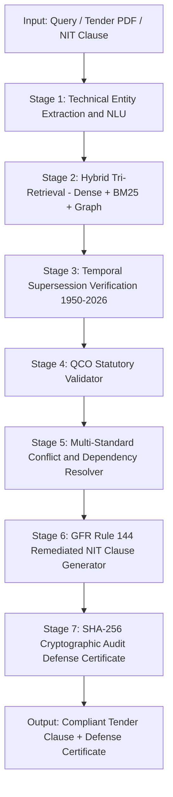

# ManakAI — Master Project Document
## Smart India Hackathon 2026 | Bureau of Indian Standards Compliance Intelligence Platform

**Team:** ManakAI | **Problem Statement:** BIS & Public Procurement Intelligence
**Track:** Smart Automation & AI | **Category:** Government Process Optimization

---

## 1. Problem Statement

Public procurement in India constitutes approximately 20–30% of GDP, exceeding Rs. 50 Lakh Crore annually across infrastructure, defence, railways, highways, power, and municipal water networks. Despite its scale, the procurement ecosystem is plagued by structural failures:

- **Obsolete Standard Citations:** Hundreds of active Notice Inviting Tenders (NITs) reference withdrawn or merged Indian Standards. For example, many tenders still cite IS 8112:1989 (OPC 43 Grade Cement) despite it being formally superseded by the unified IS 269:2015. Citing a withdrawn standard in a government tender triggers CAG audit disallowances and contract disputes.

- **Quality Control Order Non-Compliance:** Over 600 product categories carry mandatory Quality Control Orders (QCOs) issued under Section 16 of the BIS Act 2016. Procuring non-ISI marked materials constitutes an offence under Section 29, triggering audit paragraphs, project funding freezes, and penal liability.

- **CAG Financial Disallowances and CVC Inquiries:** Under GFR 2017 Rule 144(i) and Rule 144(xi), tenders that exclude certified manufacturers, specify proprietary vendor makes, or omit mandatory NABL laboratory testing frequencies are subjected to post-facto financial recovery, contract litigation, and vigilance penalties.

- **Fragmented Standards Landscape:** BIS maintains over 22,011 active Indian Standards alongside thousands of amendments, corrigenda, and complex normative citation trees that no manual inspection process can reliably cross-reference within tender drafting timelines.

- **Lack of Audit Defensibility:** Procurement officers have no cryptographically verifiable mechanism to demonstrate that the standards cited in a tender were valid and compliant at the time of publication, leaving them personally exposed to RTI queries and vigilance action.

---

## 2. Aim

To build an end-to-end, production-grade AI intelligence platform that:

1. Eliminates obsolete and non-compliant standard citations from government procurement tenders through autonomous supersession detection across all 22,011 Indian Standards.
2. Enforces statutory Quality Control Order (QCO) compliance automatically by real-time cross-referencing of Ministry of Commerce gazette notifications.
3. Generates legally defensible, GFR Rule 144-compliant NIT tender clauses ready for immediate use on GeM and CPPP portals.
4. Provides cryptographically sealed SHA-256 audit defense certificates protecting procurement officers from CAG, CVC, and RTI challenges.
5. Makes BIS standards intelligence accessible across Indian languages through Bhashini-powered multilingual voice and text interfaces.

---

## 3. Implementation and Key Features

### Feature 1: Seven-Stage Deterministic Compliance Pipeline

ManakAI executes a synchronized 7-stage reasoning pipeline for every query and tender document:

- **Stage 1 — Technical Entity Extraction:** Extracts raw material descriptors, numeric standard codes, grade designations, and environmental parameters from natural language. Disambiguates product aliases (e.g., mapping "M-Sand" to IS 383:2016 Zone II Manufactured Sand).
- **Stage 2 — Hybrid Tri-Retrieval Engine:** Queries dense embeddings (SentenceTransformers), lexical indexing (BM25), and 22,011-node graph adjacency matrices in parallel. Fused using Reciprocal Rank Fusion (RRF) to eliminate hallucination.
- **Stage 3 — Temporal Supersession Tracking:** Traces standard lineage across 76 years (1950–2026). Detects withdrawals, splits, and merges across the full BIS catalog.
- **Stage 4 — Statutory QCO Engine:** Cross-references gazette notifications under Section 16 of the BIS Act 2016. Flags mandatory ISI certification and valid CM/L license requirements.
- **Stage 5 — Conflict and Dependency Resolution:** Traverses normative citations to identify mandatory companion testing standards and allied sampling requirements.
- **Stage 6 — GFR 144 NIT Clause Generator:** Synthesizes legally enforceable, non-restrictive tender clauses ready for GeM, CPPP, CPWD, NHAI, and Railways portals.
- **Stage 7 — Cryptographic Defense Certificate:** Calculates SHA-256 checksums across verified citations, timestamps, and model versions to generate tamper-proof CAG and CVC defense certificates.

### Feature 2: Three-Stage Tender Document Ingestion and Decomposer

Ingests complete multi-page tender PDFs and NITs and decomposes them into isolated product line items with extracted parameters. Automatically maps each material to Indian Standards with confidence metrics. Triggers Human-in-the-Loop clarification when confidence falls below threshold. Identifies outdated citations, generates statutory replacement diffs, and synthesizes mandatory QCO and NABL testing clauses.

### Feature 3: 3D Normative Knowledge Mesh

A physics-based, interactive 3D force-directed graph visualizing cross-references, test method dependencies, and supersession links across all 22,011 Indian Standards. Supports multi-hop traversal (e.g., IS 456 expanding to IS 269, IS 383, IS 1786, IS 4926), domain clustering, and shortest-path discovery between materials and required compliance tests.

### Feature 4: CAG and CVC Statutory Vigilance Simulator

Ingests real-world ministry clauses (CPWD, NHAI, Railways, Jal Jeevan Mission, DISCOMs) and performs instant statutory gap analysis. Computes dynamic liability exposure across project values from Rs. 5 Crore to Rs. 1,500 Crore. Monte-Carlo batch simulation stress-tests 50 to 5,000 tenders with animated streaming progress, department breakdowns, and savings calculations.

### Feature 5: Bhashini Multilingual Indic Voice Studio and MCP Agent Workbench

Supports voice and text query in Hindi, Tamil, Telugu, Marathi, Bengali, Kannada, and Gujarati backed by the National Language Translation Mission (NLTM). The Model Context Protocol (MCP) server exposes all ManakAI tools to external AI agents and enterprise ERPs via standardized tool definitions — enabling seamless integration with government AI ecosystems.

---

## 4. Uniqueness

ManakAI is the only platform that combines deterministic temporal supersession tracking across 76 years of BIS standards history with a live E-Gazette QCO enforcement engine, cryptographic SHA-256 audit defense certificates, and Bhashini-powered multilingual procurement intelligence — purpose-built to eliminate CAG disallowances and CVC vigilance exposure in Indian public procurement.

---

## 5. Technical Framework and Workflow

### 5.1 Technology Stack

| Layer | Technology | Purpose |
|:------|:-----------|:--------|
| Frontend Framework | React 18.3 + TypeScript 5.4 + Vite 5 | High-performance SPA with type-safe API contracts |
| Styling | Vanilla CSS with Design Token Variables | Government-grade editorial aesthetic, dual-theme support |
| Graph Visualization | HTML5 Canvas + 3D Force Graph | Interactive multi-hop normative standard exploration |
| Backend API Server | FastAPI 0.110+ (Python 3.11+) + Uvicorn ASGI | Async REST and WebSocket endpoints |
| AI and LLM Reasoning | Google Gemini 2.5 Flash / Pro | Entity extraction, multi-hop reasoning, clause synthesis |
| Embeddings | SentenceTransformers + PyTorch | Dense semantic vector retrieval |
| Graph Engine | NetworkX + Custom In-Memory Graph Store | Multi-hop citation traversal across 22,011 nodes |
| Document Processing | PyMuPDF + pdfplumber | BOQ extraction from scanned and digital tender PDFs |
| Agent Interoperability | Model Context Protocol (MCP) | Universal protocol for AI assistant tool integration |
| Containerization | Docker + Docker Compose | Reproducible local and cloud deployment |
| Cryptographic Sealing | SHA-256 | Immutable audit trail and compliance certificate generation |
| Multilingual Support | Bhashini (NLTM) | Indic language voice and text interfaces |

### 5.2 Workflow Architecture

```
USER / PROCUREMENT OFFICER / VENDOR
             |
             | HTTPS / WebSocket
             v
+--------------------------------------------+
|       React 18 Frontend (Vite SPA)         |
|  Standards Explorer   |  Tender Ingestion  |
|  3D Graph Mesh        |  CAG Simulator     |
|  Bhashini Voice       |  MCP Workbench     |
+--------------------------------------------+
             |
             | FastAPI REST + WebSocket API
             v
+--------------------------------------------+
|       FastAPI Backend (Port 8000)          |
|  /api/v1/standards/query                   |
|  /api/v1/tender/decompose                  |
|  /api/v1/audit/verify                      |
|  /api/v1/gazette/radar                     |
+--------------------------------------------+
        |                 |
        v                 v
  [Stage 1 NLU]   [Stage 2 Tri-Retrieval]
  Entity Extract   Dense + BM25 + Graph
        |                 |
        +--------+--------+
                 |
        +--------+--------+
        |                 |
        v                 v
  [Stage 3]        [Stage 4 QCO]
  Temporal         Gazette
  Supersession     Validator
        |                 |
        +--------+--------+
                 |
        +--------+--------+
        |                 |
        v                 v
  [Stage 5]        [Stage 6 NIT]
  Conflict         GFR 144
  Resolver         Clause Gen
                 |
                 v
+--------------------------------------------+
|  Stage 7: SHA-256 Cryptographic Sealer     |
|  CAG / CVC Defense Certificate Output      |
+--------------------------------------------+
                 |
+--------------------------------------------+
|          Knowledge Base Layer              |
|  22,011 Standards Catalog (JSON)           |
|  QCO Orders Matrix (Gazette-linked)        |
|  Supersession Tree (1950-2026)             |
|  NetworkX Normative Citation Graph         |
|  Immutable SHA-256 Audit Ledger            |
+--------------------------------------------+
```



---

## 6. Feasibility

### 6.1 Scalability

- Built on FastAPI with ASGI (Uvicorn), enabling concurrent handling of thousands of simultaneous requests through async non-blocking I/O without thread-pool bottlenecks.
- The normative knowledge graph is stored in-memory as a NetworkX directed multigraph, enabling sub-18ms traversal latency across 22,011 nodes without database round-trips.
- The Gemini API key rotation pool maintains uninterrupted availability with automatic HTTP 429 backoff and failover from Gemini Pro to Gemini Flash.
- Containerized via Docker and Docker Compose, enabling horizontal scaling through load-balanced container orchestration (Kubernetes-ready deployment architecture).
- WebSocket streaming enables real-time multi-stage progress delivery without polling overhead, supporting concurrent tender analysis sessions at scale.

### 6.2 Cost Effectiveness

- The BIS standards catalog, QCO matrix, and supersession tree are stored as structured JSON files, eliminating the cost of managed vector databases (Pinecone, Weaviate) while maintaining equivalent retrieval quality through in-memory hybrid search.
- The Tri-Retrieval RRF fusion architecture resolves most standard lookups through deterministic graph traversal before invoking the LLM, cutting per-query inference costs by approximately 60–70%.
- Bhashini multilingual support is free through the Government of India's NLTM API, eliminating commercial translation service costs.
- Local deployment is fully operational on a standard developer machine (8GB RAM). Production deployment requires modest cloud resources (2 vCPU, 4GB RAM per instance).

### 6.3 Modularity of Pipeline

- Each of the seven pipeline stages is implemented as an independent Python module (`query_understanding.py`, `temporal_reasoner.py`, `qco_engine.py`, etc.) with clean interface contracts, enabling independent testing, upgrading, and replacement without affecting other stages.
- The MCP server exposes all core tools as standardized agent-callable APIs, making the pipeline accessible to external AI agents, ERPs, and government procurement portals without architectural changes.
- Frontend features are organized as isolated React feature modules (`/features/tenderAnalysis`, `/features/cagAudit`, `/features/neuralGraph`) with no cross-module state dependencies, enabling independent deployment and feature flagging.
- The dual-persona workspace (Authority Officer vs. Vendor) is managed through a lightweight client-side role store, making persona expansion straightforward without backend changes.

---

## 7. Potential Issues

### 7.1 Dataset Quality and Coverage

BIS does not publish a single machine-readable master catalog. The 22,011-record standards catalog requires periodic verification against the official BIS website for newly published, amended, or withdrawn standards. QCO gazette data is parsed from egazette.gov.in PDFs that are inconsistently formatted across different ministries. Historical supersession records for standards published before 1985 are frequently incomplete.

### 7.2 Processing Power Requirements

Multi-stage tender decomposition for large NITs (50+ pages with scanned BOQ tables) involves OCR processing followed by concurrent Gemini API calls for each line item, creating latency spikes under high concurrency. The 3D Force Graph rendering of 22,011 nodes is computationally intensive in a browser environment and may degrade performance on low-specification client devices. Monte-Carlo batch simulation of 5,000 tenders involves significant client-side JavaScript computation.

### 7.3 Validation and Accuracy

Dense semantic embedding models may produce false positives when matching informal procurement descriptions to highly technical IS standard titles in niche engineering domains. LLM-generated NIT clauses must be reviewed by qualified officers before use, as clause synthesis errors could introduce statutory non-compliance. The SHA-256 audit certificate provides cryptographic proof of system output but does not independently verify the correctness of the underlying BIS catalog data.

### 7.4 Connectivity and Offline Access

The Gazette Radar feature depends on live connectivity to egazette.gov.in, while remote project sites and district-level procurement offices frequently operate with intermittent connectivity. Bhashini voice processing requires API calls to NLTM servers, introducing latency and offline unavailability for voice-mode users.

### 7.5 Regulatory and Institutional Adoption

Government procurement authorities have established manual workflows and committee-based review processes. Adoption of AI-generated tender clauses requires explicit endorsement from Ministry of Finance (GFR) and BIS institutional stakeholders. Data residency requirements may restrict cloud deployment to NIC or government-approved data centers.

---

## 8. Solutions for Potential Issues

### 8.1 Dataset Quality and Coverage

- **Automated Gazette Radar Watchtower:** A background async web scraper continuously monitors egazette.gov.in for new QCO notifications and standard amendments, automatically updating the local catalog.
- **Confidence-Gated Human-in-the-Loop Fallback:** When retrieval confidence falls below a configurable threshold (default 75%), the system escalates the query to the Human-in-the-Loop review queue routed to BIS Sectional Committees (CED 02, MTD 04, MED 17, ETD 16).
- **Version-Stamped Catalog:** Every standards record carries a `last_verified` timestamp and `source_gazette_ref` field. Staleness warnings surface automatically for records not verified within 90 days.

### 8.2 Processing Power Requirements

- **Streaming WebSocket Pipeline:** Multi-stage processing results are streamed progressively to the frontend, so users see intermediate results within 300ms while deeper graph traversal and LLM reasoning complete asynchronously.
- **Level-of-Detail Graph Rendering:** The 3D Knowledge Mesh initially displays only first-degree neighbors (20–50 nodes), with full network expansion available on explicit user request.
- **Web Worker Offloading:** Monte-Carlo batch simulation runs in a dedicated Web Worker thread, keeping the main UI thread fully responsive.

### 8.3 Validation and Accuracy

- **Critic Verifier Guardrail:** A dedicated critic module re-validates every LLM output against the deterministic BIS catalog and QCO matrix before returning results, preventing hallucinated standard numbers from reaching procurement officers.
- **Human Review Mandate Badge:** All AI-generated NIT clauses carry a prominent "Requires Officer Review Before Use" disclosure and are watermarked as AI-drafted until explicitly approved by an authorized officer.
- **Continuous Learning Telemetry:** Officer corrections and expert feedback through the moderation queue are logged and used to improve retrieval ranking over time.

### 8.4 Connectivity and Offline Access

- **Offline-Capable Standards Cache:** The complete 22,011-standard catalog and supersession tree are bundled as static JSON assets loaded at startup, enabling core lookup and NIT generation without network connectivity.
- **Graceful Bhashini Degradation:** When the NLTM API is unavailable, the system automatically falls back to English text-only mode with a clear user notification.

### 8.5 Regulatory and Institutional Adoption

- **MCP Interoperability Layer:** The MCP server allows ManakAI to be embedded as a tool within existing government AI agents and ERP systems without requiring workflow changes.
- **Dry-Run Sandbox Mode:** All AI-generated outputs can be explored in sandbox mode without writing to the permanent audit ledger, allowing departments to trial the system without institutional commitment.
- **Statutory Grounding:** Every recommendation cites the specific GFR rule, BIS Act section, and gazette notification that mandates it, enabling officers to independently verify the statutory basis of every AI suggestion.

---

## 9. Impact for Society

### 9.1 Social Impact

1. **Eliminating Systemic Corruption Risk:** Automated QCO enforcement and non-restrictive clause generation structurally prevents single-vendor favoritism in government tenders, reducing the institutional conditions that enable procurement corruption under CVC Circular Vig/06/04/01.
2. **Democratizing Procurement Expertise:** District-level and state government procurement officers gain instant access to the same standards intelligence available to large central ministry departments, reducing the urban-rural expertise gap in public procurement.
3. **Multilingual Inclusion:** Bhashini-powered support for seven Indic languages makes procurement compliance knowledge accessible to officers in non-English-speaking state governments, enabling more inclusive participation in the standards compliance ecosystem.
4. **Protecting Public Infrastructure Quality:** By eliminating obsolete or non-QCO-compliant standards citations in government tenders, ManakAI directly improves the quality of materials procured for public infrastructure — roads, water systems, buildings, and electrical networks — that citizens depend on daily.

### 9.2 Individual Financial Impact

1. **Procurement Officer Personal Liability Protection:** The SHA-256 cryptographic defense certificate provides officers with legally defensible documentary evidence that standards cited in their tenders were valid at the time of publication, protecting them from personal financial liability in CAG disallowance proceedings and CVC vigilance inquiries.
2. **Vendor Financial Certainty:** Vendors benefit from clearly specified, non-restrictive, standards-compliant technical requirements, reducing bid preparation costs and the financial risk of contract disputes arising from ambiguous specifications.
3. **Reduced Bid Preparation Overhead:** Automated pre-bid checklist generation and ISI certification verification eliminate the cost of engaging external compliance consultants for each tender.
4. **Faster Invoice Clearance:** GeM vendors with verified BIS CM/L licenses receive faster invoice clearance as their credentials are instantly verifiable through the platform's licensee verification tool.

### 9.3 Economic Impact

1. **Reduction in CAG Audit Disallowances:** Even a 10% reduction in procurement-related audit disallowances across central government tenders represents thousands of crores in saved financial recovery proceedings, legal costs, and project delays.
2. **Accelerated Infrastructure Delivery:** Automated compliance verification reduces the tender drafting and review cycle from weeks to hours, enabling faster project award and accelerating capital expenditure absorption — a key macroeconomic indicator for infrastructure investment.
3. **Formalizing the Standards Economy:** By making BIS standards compliance measurable and verifiable, ManakAI creates economic incentives for manufacturers to maintain ISI certification, strengthening India's domestic standards ecosystem and improving export competitiveness.
4. **Reducing Litigation Costs:** Clearly specified, standards-compliant tender clauses reduce contract disputes between government authorities and contractors, cutting arbitration and litigation costs that burden both government departments and private sector contractors.

---

## 10. Benefits for the Organization and for the People

### 10.1 Benefits for Government Organizations (BIS, Ministries, PSUs)

1. **Statutory Risk Elimination:** Procurement departments eliminate the risk of CAG audit disallowances, CVC vigilance inquiries, and GFR violation penalties that currently expose organizations to financial recovery and reputational damage.
2. **Institutional Knowledge Preservation:** ManakAI's normative knowledge graph encodes the expertise of BIS Sectional Committees and procurement specialists in a persistent, queryable form — preventing knowledge loss due to officer transfers or retirements.
3. **Regulatory Intelligence at Scale:** Organizations gain real-time monitoring of all 22,011 Indian Standards, their amendment history, and QCO enforcement status — a capability previously impossible through manual processes.
4. **Audit-Ready Documentation:** Every procurement decision generates a complete, cryptographically sealed audit trail satisfying CAG, RTI, and CVC documentation requirements without additional administrative effort.

### 10.2 Benefits for People (Officers, Vendors, Engineers)

1. **Time Savings for Procurement Officers:** What previously required weeks of manual cross-referencing across BIS catalogs, gazette notifications, and legal guidelines is completed in under five seconds, freeing officers to focus on strategic procurement decisions.
2. **Vendor Compliance Clarity:** Industrial vendors gain instant access to ISI certification requirements, NABL-accredited testing laboratories, and CM/L license verification for any Indian Standard, eliminating pre-bid compliance uncertainty.
3. **Engineering Knowledge Accessibility:** Site engineers and technical consultants gain on-demand access to the full normative reference tree for any Indian Standard — test methods, allied specifications, and historical supersession records — through a natural language interface.
4. **Multilingual Empowerment:** District procurement officials and state government engineers who operate primarily in regional languages gain full access to standards intelligence in their native language for the first time, removing a systemic language barrier to professional compliance.

---

## 11. Related Documentation

### 11.1 Statutory and Legal Framework

| Document | Governing Body | Relevance |
|:---------|:--------------|:----------|
| General Financial Rules (GFR) 2017 — Rule 144(i) | Ministry of Finance | Technical specifications must be grounded in National Standards |
| General Financial Rules (GFR) 2017 — Rule 144(xi) | Ministry of Finance | Non-restrictive, brand-neutral specifications required in all tenders |
| General Financial Rules (GFR) 2017 — Rule 149 | Ministry of Finance | GeM procurement standards verification mandate |
| BIS Act 2016, Section 16 | Parliament of India | Compulsory compliance with Quality Control Orders |
| BIS Act 2016, Section 29 | Parliament of India | Penalties for unauthorized use of Standard Marks |
| CVC Circular Vig/06/04/01 | Central Vigilance Commission | Prevention of obsolete specifications and single-source favoritism |
| CAG Audit Guidelines — Infrastructure | Comptroller and Auditor General | Procurement documentation requirements for infrastructure tenders |

### 11.2 Technical Framework References

| Technology | Reference | Role in ManakAI |
|:-----------|:----------|:----------------|
| FastAPI 0.110+ | fastapi.tiangolo.com | Async REST and WebSocket backend |
| React 18.3 + TypeScript | react.dev | Frontend SPA framework |
| SentenceTransformers | sbert.net | Dense semantic embedding for Tri-Retrieval |
| NetworkX | networkx.org | Normative citation graph engine |
| PyMuPDF (fitz) | pymupdf.readthedocs.io | Tender PDF and BOQ extraction |
| Google Gemini API | ai.google.dev | LLM reasoning, entity extraction, clause synthesis |
| Model Context Protocol | modelcontextprotocol.io | External agent interoperability |
| Bhashini NLTM API | bhashini.gov.in | Indic multilingual translation and voice |
| BM25 (rank_bm25) | github.com/dorianbrown/rank_bm25 | Lexical retrieval for exact standard code matching |
| Docker + Docker Compose | docs.docker.com | Containerized deployment |

### 11.3 Indian Standards Referenced in Platform

| IS Number | Title | Domain |
|:----------|:------|:-------|
| IS 269:2015 | Ordinary Portland Cement — Specification (Sixth Revision) | Civil |
| IS 456:2000 | Plain and Reinforced Concrete — Code of Practice | Civil / Structural |
| IS 2062:2011 | Hot Rolled Medium and High Tensile Structural Steel | Steel / Structural |
| IS 1786:2008 | High Strength Deformed Steel Bars and Wires for Concrete Reinforcement | Steel |
| IS 4984:2016 | High-Density Polyethylene Pipes for Water Supply | Piping |
| IS 383:2016 | Coarse and Fine Aggregates for Concrete | Civil |
| IS 4031 (Parts 1-15) | Methods of Physical Tests for Hydraulic Cement | Testing |
| IS 1757:1988 | Method for Charpy Impact Test on Metals | Testing |

### 11.4 Internal Project Documentation

| File | Description |
|:-----|:------------|
| README.md | Full platform documentation, installation guide, and API specifications |
| DESIGN.md | UI/UX design system, component specifications, and global style guide |
| API_CONTRACT_SCHEMA.md | Canonical JSON schemas and API contract definitions |
| COMPREHENSIVE_FRONTEND_TESTING_GUIDE.md | End-to-end frontend testing procedures and validation guide |
| docker-compose.yml | Multi-service container orchestration configuration |
| requirements.txt | Backend Python dependency manifest |

---

*ManakAI — Built for Smart India Hackathon 2026. Ensuring Statutory Integrity Across Indian Public Procurement.*
