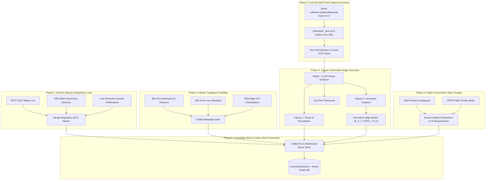

# Master Implementation Plan: Comprehensive Data Ingestion & Knowledge Graph Architecture for Indian Standards (BIS/QCO/GeM)

---

## 1. Executive Architecture Overview

To power an enterprise-grade AI Recommendation Engine, Tender-to-Standard Diff Engine, and Statutory Compliance Validator for Indian Public Procurement, we require an exhaustive multi-layered knowledge corpus covering:
1. **Canonical Master Standard Catalog & Amendments** (BIS Directory across all 15 technical divisions).
2. **Full Text & Clause-Level Structured Content** (Scope Clause 1, Normative References Clause 2, Test Methods, Tolerances from Internet Archive and BIS).
3. **Statutory Regulatory Orders (QCOs & Mandatory Schemes)** (DPIIT, MeitY CRS, MoS, MoC, Scheme-I ISI Mark, Scheme-II CRS, Scheme-IV Hallmarking).
4. **Conformity Ecosystem Ground Truth** (MANAK active licensees, LIMS accredited testing laboratories).
5. **Real-world Procurement Corpus** (GeM Category Specifications, Golden Parameters, CPPP Tender BoQs).
6. **Multilingual Technical Lexicon** (English, Hindi, vernacular technical terms).

```
 ┌────────────────────────────────────────────────────────────────────────────────────────────────────────┐
 │                                   PUBLIC PROCUREMENT AI ENGINE                                         │
 │              (Semantic Standard Recommendation • Normative Graph • QCO Compliance • Spec Diff)         │
 └────────────────────────────────────────────────┬───────────────────────────────────────────────────────┘
                                                  │
                 ┌────────────────────────────────┴────────────────────────────────┐
                 ▼                                                                 ▼
 ┌───────────────────────────────┐                                 ┌───────────────────────────────┐
 │   HYBRID VECTOR RAG STORE     │                                 │   KNOWLEDGE GRAPH (NEO4J)     │
 │  (Clause 1 Scope, Specs, BoQs)│                                 │ (Normative Refs, QCO, GeM-IS) │
 └───────────────▲───────────────┘                                 └───────────────▲───────────────┘
                 │                                                                 │
 ┌───────────────┴─────────────────────────────────────────────────────────────────┴───────────────┐
 │                               UNIFIED DATA STORAGE (`/data/`)                                   │
 ├─────────────────┬─────────────────┬──────────────────┬─────────────────┬────────────────────────┤
 │  /data/metadata │ /data/fulltext  │ /data/regulatory │ /data/ecosystem │ /data/procurement_corp │
 │  - BIS Catalog  │ - IA OCR txt    │ - DPIIT QCOs     │ - MANAK Licenses│ - GeM Category Specs   │
 │  - Gazette Logs │ - Clause Parsed │ - CRS MeitY      │ - LIMS Test Labs│ - CPPP Tender BoQs     │
 │  - Division ICS │ - PDF Extracts  │ - Gazette Orders │ - Lab Capacity  │ - Golden Parameters    │
 └─────────────────┴─────────────────┴──────────────────┴─────────────────┴────────────────────────┘
```

---

## 2. Master Target Directory Structure (`data/`)

The local storage layout is engineered for modularity, strict schema validation, fast vectorization, and graph ingestion:

```bash
SIH2026/
├── data/
│   ├── 01_master_catalog/            # Layer 1: Canonical Standard Metadata
│   │   ├── raw_json/                 # Raw scrapes from BIS portals by Division (CED, ETD, MED, etc.)
│   │   ├── unified_standards.json    # Deduplicated, normalized master catalog
│   │   ├── division_committees.json  # 15 Division Councils & Sectional Committees mapping
│   │   ├── ics_classification.json   # ICS (International Classification for Standards) hierarchical trees
│   │   └── amendments_history.json   # Gazette dates, amendment numbers (Amd 1..N), corrigenda
│   │
│   ├── 02_fulltext_corpus/           # Layer 2: Full Text & Clause-Level Data
│   │   ├── raw_ia_downloads/         # Raw `.txt` and `.djvu.txt` from Internet Archive (gov.in.is.*)
│   │   ├── raw_pdfs/                 # Downloaded public safety PDFs (where OCR text needs re-parsing)
│   │   ├── parsed_clauses/           # Extracted structured JSON per IS number:
│   │   │   ├── IS_456_2000.json      # { scope: "...", normative_refs: [...], tests: [...], terms: [...] }
│   │   │   └── IS_1786_2008.json
│   │   └── clause2_normative_graph/  # Extracted relational edge list (IS_A -> CITES -> IS_B)
│   │
│   ├── 03_regulatory_qco/            # Layer 3: Statutory Quality Control Orders & Schemes
│   │   ├── dpiit_master_qco.json     # DPIIT Compulsory Certification Orders
│   │   ├── crs_meity_solar.json      # Scheme-II Compulsory Registration Scheme (Electronics/Solar)
│   │   ├── line_ministries_qco/      # Steel, Chemicals, Heavy Industries, Textiles, Mines QCO orders
│   │   ├── hallmarking_scheme.json   # Gold/Silver Jewellery & Bullion (Scheme-IV)
│   │   ├── qco_exemptions.json       # MSME grace periods, R&D/Export exemption clauses
│   │   └── qco_mapping_matrix.json   # Indexed: { IS_Number -> { is_mandatory, scheme, ministry, gazette_date } }
│   │
│   ├── 04_conformity_ecosystem/      # Layer 4: Verification Ground Truth
│   │   ├── manak_licensees.json      # Active ISI & CRS license holders per IS number
│   │   ├── lims_testing_labs.json    # BIS-recognized testing laboratories, capabilities, test parameters
│   │   └── fee_schedules.json        # Standard testing fee and turnaround tables
│   │
│   ├── 05_procurement_gold_corpus/   # Layer 5: Public Procurement Evaluation & Training
│   │   ├── gem_categories.json       # GeM Product Categories with mapping to IS codes
│   │   ├── gem_spec_sheets/          # Downloaded GeM Golden Specification parameter templates
│   │   ├── cppp_live_tenders/        # Real government Notice Inviting Tenders (NIT), BoQs, ATCs
│   │   └── test_benchmark_diff/      # Annotated ground-truth golden pairs (Tender Text <-> Outdated/Correct IS)
│   │
│   └── 06_multilingual_lexicon/      # Layer 6: Vernacular & Synonym Mappings
│       ├── technical_glossary_hi.json# CSTT / BIS Hindi-English technical terms (e.g. सरिए -> TMT Bar IS 1786)
│       └── domain_synonyms.json      # Trade names & colloquial procurement terms mapping
│
├── scripts/                          # Automated Ingestion & Processing Pipeline
│   ├── 01_scrape_bis_catalog.py      # Async crawler for BIS DG Dashboard & Catalogue
│   ├── 02_fetch_internet_archive.py  # Targeted bulk puller from Internet Archive
│   ├── 03_parse_clauses_graph.py     # Regex/LLM parser for Clause 1 (Scope) & Clause 2 (Normative)
│   ├── 04_scrape_qco_crs.py          # DPIIT, CRS, and Gazette QCO parser
│   ├── 05_scrape_manak_lims.py       # Licensee & Lab test parameter extractor
│   ├── 06_scrape_gem_specs.py        # GeM category & golden parameter crawler
│   ├── 07_build_knowledge_graph.py   # Ingests nodes & edges into Neo4j
│   └── 08_generate_rag_embeddings.py # Generates chunk embeddings & metadata filters for vector search
│
└── config/
    ├── settings.yaml                 # Rate limits, proxy configs, batch sizes, retry parameters
    └── schemas.py                    # Pydantic schemas for data integrity validation
```

---

## 3. Data Source Matrix & Extraction Blueprint

| Layer & Source | Data Harvested | Target Size / Coverage | Method & Protocol | Catch & Mitigation |
| :--- | :--- | :--- | :--- | :--- |
| **1. BIS DG Dashboard & Published Standards**<br>`services.bis.gov.in/php/BIS_2.0/dgdashboard/` | Full catalogue across 15 Divisions: CED, ETD, MED, TXD, FAD, CHAD, MSD, LITD, PGD, MTD, WRD, TED, SSD, etc. Standard number, title, status, committee, amendments. | ~22,000+ Standards metadata records | `httpx` async sessions, multi-threaded worker pool with rotating user agents. | Server-rendered PHP; paginated tables. Handled via direct form-post requests and pagination loops. |
| **2. Internet Archive (Public Safety Standards)**<br>`archive.org/details/gov.in.is.*` | Unlocked Full Text, OCR text (`_djvu.txt`), XML metadata, full PDF downloads for published Indian standards. | ~18,000+ full-text standard documents | Python `internetarchive` SDK with batch item queries and multithreaded txt file streaming. | OCR noise on older standards. Handled via regex post-cleaners and LLM structure correction. |
| **3. BIS Know Your Standard & e-Sale Portal**<br>`standards.bis.gov.in` & `standardsbis.bsbedge.com` | Official Abstracts, Scope (Clause 1) excerpts, Price, Gazette Notification dates, ICS tags. | 100% of Active Standards | Headless browser automation (Playwright stealth) & direct JSON endpoints. | Dynamic captcha on deep searches. Mitigated using cached session tokens and direct catalog endpoints. |
| **4. DPIIT & Line Ministry QCO Directives**<br>`bis.gov.in/product-certification/products-under-compulsory-certification/` | Complete list of products under mandatory ISI Mark (Scheme-I) and Scheme-X across all ministries. | 750+ Product Categories, 1,200+ IS standards | Automated tabular scrapers + Gazette PDF parser (`pdfplumber` / `PyMuPDF`). | Notification updates scattered across ministry gazettes. Tracked via master BIS compulsory directory. |
| **5. CRS MeitY/BIS Electronics Portal**<br>`crsbis.in/BIS/products.do` | IT goods, telecom, solar modules, inverters, secondary cells, LED luminaires under Scheme-II. | 90+ Product Categories, 600+ IS standards | Direct HTML table parser on CRS product catalog. | Multi-tier revisions for safety standards (e.g. IS 13252 -> IS 16046). Mapped via revision logs. |
| **6. MANAK & LIMS Portals**<br>`manakonline.in` & `lims.bis.gov.in` | Active manufacturer license verification, recognized test labs and parameter-wise test facilities. | IS-wise testing capability and license directory | Reverse-engineered REST endpoints (`/MANAK/API/...`) + fallback DOM parser. | Session expiration on automated hits. Handled via token refresher. |
| **7. GeM Category Specs & Golden Parameters**<br>`gem.gov.in` & `bidplus.gem.gov.in` | Product category spec templates, technical parameter ranges, mandatory IS standard citations in real tenders. | 10,000+ Category Specification templates | Playwright script navigating GeM category master catalog and spec download APIs. | Heavy dynamic JS rendering. Addressed via headless Chromium automation with request interception. |
| **8. CPPP / GeM Live & Archived Tenders**<br>`eprocure.gov.in` & `gem.gov.in/tenders` | Real Notice Inviting Tenders (NIT), BoQs, ATC files containing outdated standard citations for Diff evaluation. | 500+ Sample Tenders across civil, electrical, IT, medical, and mechanical sectors | Scrapy crawler downloading public tender PDFs and BoQ Excel sheets. | Captcha on bulk CPPP download. Mitigated using GeM public bid downloads and archive pools. |

---

## 4. Structured Data Schema (Pydantic / Unified JSON)

Every single standard ingested will be normalized into this unified JSON model:

```json
{
  "is_number": "IS 1786",
  "year_published": 2008,
  "reaffirmation_year": 2022,
  "edition": "Fourth Revision",
  "title": "High Strength Deformed Steel Bars and Wires for Concrete Reinforcement - Specification",
  "status": "ACTIVE",  // ACTIVE | WITHDRAWN | SUPERSEDED | UNDER_REVISION
  "superseded_by": null,
  "supersedes": ["IS 1139:1966"],
  "technical_committee": {
    "division_code": "CED",
    "division_name": "Civil Engineering Division",
    "committee_code": "CED 54",
    "committee_name": "Concrete Reinforcement Sectional Committee"
  },
  "ics_codes": ["77.140.15", "91.080.40"],
  "equivalent_international_standards": [
    { "standard_id": "ISO 6935-2:2019", "relation": "MODIFIED" }
  ],
  "amendments": [
    { "amendment_no": 1, "gazette_date": "2012-05", "summary": "Addition of Fe 600 grade" },
    { "amendment_no": 2, "gazette_date": "2017-08", "summary": "Mandatory yield stress tolerance limits" },
    { "amendment_no": 3, "gazette_date": "2020-03", "summary": "Inclusion of corrosion resistant elements" }
  ],
  "clause_data": {
    "clause_1_scope": "This standard covers the requirements of high strength deformed steel bars and wires for use as reinforcement in concrete in sizes from 4 mm to 40 mm.",
    "clause_2_normative_references": [
      { "is_number": "IS 1608", "title": "Metallic materials - Tensile testing at room temperature", "type": "TEST_METHOD" },
      { "is_number": "IS 1599", "title": "Metallic materials - Bend test", "type": "TEST_METHOD" },
      { "is_number": "IS 228", "title": "Methods for chemical analysis of steels", "type": "CHEMICAL_ANALYSIS" },
      { "is_number": "IS 2770", "title": "Methods of testing bond in reinforced concrete", "type": "PERFORMANCE_TEST" }
    ],
    "clause_3_terminology": ["Deformed Bar", "Nominal Size", "Characteristic Strength"],
    "key_requirements_summary": "Grades: Fe 415, Fe 415D, Fe 500, Fe 500D, Fe 550, Fe 550D, Fe 600. Specifying minimum 0.2% proof stress, elongation %, and bend properties."
  },
  "regulatory_compliance": {
    "is_mandatory": true,
    "scheme": "Scheme-I (ISI Mark)",
    "notifying_ministry": "Ministry of Steel",
    "qco_order_name": "Steel and Steel Products (Quality Control) Order, 2024",
    "qco_gazette_notification": "S.O. 1234(E)",
    "enforcement_date": "2024-04-01",
    "exemption_clauses": "Imports under Advance Authorisation Scheme exempt under specific conditions."
  },
  "procurement_context": {
    "gem_categories": ["TMT Bars", "Reinforcement Steel", "Civil Construction Material"],
    "common_mis_citations": ["IS 1786:1985 (Outdated)", "IS 432 (Mild steel bars instead of TMT)"],
    "mandatory_allied_standards": ["IS 456 (Plain and Reinforced Concrete)", "IS 13920 (Ductile Design)"]
  },
  "fulltext_available": true,
  "source_document_path": "data/02_fulltext_corpus/raw_ia_downloads/is.1786.2008.djvu.txt"
}
```

---

## 5. Execution Pipeline: 6-Phase Data Harvesting & Processing Plan



### Detailed Phase Breakdown

#### **Phase 1: Regulatory & Statutory Seed List Harvest (Immediate Priority)**
*   **Goal:** Build the 100% accurate compliance filter so every recommendation instantly flags whether a standard is legally mandatory under Indian Law.
*   **Actions:**
    1. Scrape the complete BIS Compulsory Certification Directory (Scheme-I ISI Mark ~750 items).
    2. Scrape the Compulsory Registration Scheme (CRS) portal (`crsbis.in/BIS/products.do`) for all electronic, IT, battery, and solar categories (Scheme-II).
    3. Scrape Line Ministry QCO gazette notifications (Ministry of Steel, Chemicals & Petrochemicals, Heavy Industries, Textiles, DPIIT).
    4. Compile `qco_mapping_matrix.json` linking every mandatory standard to its notifying ministry, gazette notification number, and enforcement date.

#### **Phase 2: Canonical Master Catalog Crawling (22,000+ Standards)**
*   **Goal:** Create the complete metadata universe of every Indian Standard ever published.
*   **Actions:**
    1. Async scrape the BIS DG Dashboard across all 15 Technical Divisions:
       * CED (Civil), ETD (Electrotechnical), MED (Mechanical), TXD (Textiles), FAD (Food & Agriculture), CHAD (Chemical), MSD (Management & Systems), LITD (Electronics & IT), PGD (Production & General), MTD (Metallurgical), WRD (Water Resources), TED (Transport), SSD (Services Sector).
    2. Extract standard number, year, active/withdrawn status, reaffirmation status, sectional committee details, ICS codes, and latest amendment lists.
    3. Save deduplicated records to `data/01_master_catalog/unified_standards.json`.

#### **Phase 3: Bulk Full-Text Ingestion (Internet Archive & BIS)**
*   **Goal:** Download full clause-level text and scope descriptions for deep semantic search and RAG embeddings.
*   **Actions:**
    1. Execute batch queries on Internet Archive collection `publicsafetycode` using identifier pattern `gov.in.is.*`.
    2. Stream and download `.djvu.txt` (OCR text) directly to bypass heavy PDF processing latency.
    3. For missing high-priority QCO standards, download raw PDFs and process via `PyMuPDF` / `Tesseract OCR`.
    4. Save clean text files to `data/02_fulltext_corpus/raw_ia_downloads/`.

#### **Phase 4: Clause Parser & Normative Graph Extraction**
*   **Goal:** Construct the knowledge graph connecting parent product standards to allied test methods, sampling rules, and safety specs.
*   **Actions:**
    1. Run high-speed regex & NLP parser on raw texts to isolate:
       * **Clause 1 (Scope):** Core product boundary used for semantic RAG embeddings.
       * **Clause 2 (Normative References):** Exact list of cited standards (e.g. IS 1608, IS 1599, IS 228).
       * **Clause 3 (Terminology):** Definitions of technical terms.
       * **Clause 4+ (Tolerances & Test Methods):** Physical, chemical, and performance metrics.
    2. Construct adjacency matrices and directional graph edges:
       * `(Product_IS)-[:NORMATIVE_REFERENCE {relation_type: "TEST_METHOD"}]->(Test_IS)`
       * `(Product_IS)-[:MANDATED_BY]->(QCO_Order)`
       * `(Product_IS)-[:SUPERSEDES]->(Old_IS)`
       * `(Product_IS)-[:AMENDED_BY]->(Amendment)`

#### **Phase 5: GeM & CPPP Procurement Spec Corpus Scraping**
*   **Goal:** Harvest real-world procurement requirements, golden parameter ranges, and tender drafts for evaluation.
*   **Actions:**
    1. Scrape GeM Product Category master trees and download Technical Specification sheets (which state governing IS numbers and mandatory tolerance bands).
    2. Ingest sample Notice Inviting Tenders (NIT) and Bills of Quantity (BoQ) from CPPP / GeM for diverse engineering domains (Civil, Electrical, Medical, IT).
    3. Annotate a golden benchmark dataset for testing the "Draft-to-Spec Diff Tool" (detecting obsolete standard citations, missing normative test standards, and unfulfilled QCO mandates).

#### **Phase 6: Multi-Lingual Lexicon & Unified Vector/Graph Generation**
*   **Goal:** Enable seamless search in Hindi, transliterated Indian English, and technical jargon.
*   **Actions:**
    1. Compile CSTT / BIS multilingual glossaries mapping vernacular names to standard numbers.
    2. Generate dense vector embeddings (using `BAAI/bge-large-en-v1.5` or `text-embedding-3-large`) for all Clause 1 Scope texts and GeM spec summaries with rich metadata payload filters (`is_mandatory`, `status`, `division`).
    3. Ingest all relational edges into Neo4j graph database.

---

## 6. Verification, Validation & Resiliency Protocols

To guarantee 100% reliability, zero data loss, and uninterrupted scraping:
1. **Checkpointing & Resumability:** Every scraper stores its state in `.checkpoint.json`. If a network interruption occurs, the crawler resumes precisely from the last unharvested record.
2. **Exponential Backoff & Rate Limit Handling:** Strict jittered exponential backoff (1s - 8s) with rotating client headers to prevent 429/403 blocks.
3. **Pydantic Schema Validation:** Raw scraped data passes through strict Pydantic models before being committed to JSON/DB storage.
4. **Data Integrity Metrics & Coverage Audit:**
   * Audit 1: Total BIS active standards count vs. master registry (~22,000+).
   * Audit 2: Mandatory QCO product coverage (100% match with DPIIT & MeitY lists).
   * Audit 3: Normative Graph Connectivity (No orphan nodes for high-priority procurement categories).

---

## 7. Next Step: Implementation Execution

With this master plan confirmed, we will proceed to execute the scrapers sequentially starting with:
1. Setting up the folder structure in `/SIH2026/data/`.
2. Running the **Regulatory & Mandatory QCO Harvester** (`scripts/04_scrape_qco_crs.py`).
3. Running the **Master BIS Catalog Scraper** (`scripts/01_scrape_bis_catalog.py`).
4. Running the **Internet Archive Full Text Harvester** (`scripts/02_fetch_internet_archive.py`).
5. Running the **Clause & Normative Graph Builder** (`scripts/03_parse_clauses_graph.py`).
6. Ingesting **GeM Procurement Specs** (`scripts/06_scrape_gem_specs.py`).
